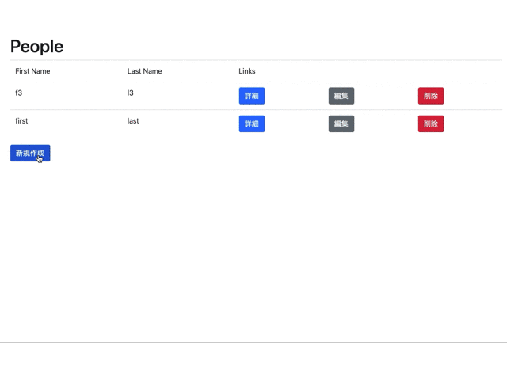

# README

## これはなにか

ベースとなるモデルと`has_many`な関係になっているモデルとを一緒に作成・更新するためのサンプル実装です。



## 前提

- Ruby 2.6.6
- Rails 6.0.3.2

## ポイント

### 前提

このサンプルでは、`Person`モデルに対して`Address`モデルが`has_many`という関係になっています。`app/models/person.rb`において

```ruby
has_many :addresses
```

また、`app/models/address.rb`において

```ruby
belongs_to :person
```

と書かれている状態です。

### モデル

[accepts_nested_attributes_for](https://api.rubyonrails.org/classes/ActiveRecord/NestedAttributes/ClassMethods.html#method-i-accepts_nested_attributes_for)を使うのが一番お手軽です。具体的にはPersonモデルに対して

```ruby
accepts_nested_attributes_for :addresses, allow_destroy: true, reject_if: :all_blank
```

を追記します。オプションの`allow_destory`は既存のメンバーを削除することを許すか否かの設定、`reject_if`は送られてきた属性から無視する設定です。詳細は[accepts_nested_attributes_forのドキュメント](https://api.rubyonrails.org/classes/ActiveRecord/NestedAttributes/ClassMethods.html#method-i-accepts_nested_attributes_for)を参照してください。

### コントローラ

[Strong parameter](https://railsguides.jp/action_controller_overview.html#strong-parameters)の設定を行います。
`app/controllers/people_controller.rb`において下記のような記述を行います。

```ruby
params.require(:person).permit(:first_name, :last_name,
                               addresses_attributes: [:id, :kind, :street, :_destroy]
                               )
```

`permit`の中身や`addresses_attributes`の配列の中身は、それぞれのモデルの属性を記します。`addresses_attributes`の配列の中身はモデルの属性以外に`:id`と`:_destroy`を追加する必要があります。

### ビュー

`Address`モデルを作成するための部分テンプレートを作成します。ここでは、`app/views/people/_address_fields.html.erb`というファイルを作り、中身を以下のようにします。

```html
<div class='nested-fields form-row'>
  <%= f.hidden_field :_destroy %>
  <div class='form-group col-sm-4'>
    <%= f.label :kind %>
    <%= f.text_field :kind, class: 'form-control' %>
  </div>
  <div class='form-group col-sm-4'>
    <%= f.label :street %>
    <%= f.text_field :street, class: 'form-control' %>
  </div>
  <div>
    <%= link_to '削除', '#', class: 'remove_fields btn btn-danger' %>
  </div>
</div>
```

ポイントは、以下4つです。

- 部分テンプレート名（関連名の単数形 + `_fields.html.erb`）
    - 後のヘルパーの処理で必要
- 部分テンプレートの先頭に付けた`nested-fields`クラス
    - 後のJavaScriptの処理で必要
- `f.hidden_field :_destroy`
- `link_to '削除', '#', class: 'remove_fields btn btn-danger'`

`f.hidden_field :_destroy`はモデルでの`allow_destory`に対応するために必要になります。`link_to '削除', '#', class: 'remove_fields btn btn-danger'`は後述のJavaScriptで具体的な処理を実装します。

上記で作成した部分テンプレートを`People`モデルを編集するフォームに追記します。

```html
<fieldset>
<legend>Addresses:</legend>
  <%= f.fields_for :addresses do |addresses_form| %>
    <%= render 'address_fields', f: addresses_form %>
  <% end %>
  <%= link_to_add_fields '住所の追加', f, :addresses %>
</fieldset>
```

`link_to_add_fields '住所の追加', f, :addresses`の処理は後述のヘルパーで実装します。

### ヘルパー

前述のビュー内の`link_to_add_fields '住所の追加', f, :addresses`を実装します。

```ruby
module ApplicationHelper
  def link_to_add_fields(name, f, association)
    new_obj = f.object.send(association).klass.new
    # idは一意であれば何でもよい。
    id = new_obj.object_id

    fields = f.fields_for(association, new_obj, child_index: id) do |builder|
      render(association.to_s.singularize + "_fields", f: builder)
    end

    link_to(name, '#', class: 'add_fields btn btn-primary', data: {id: id, fields: fields.gsub('\n', '')})
  end
end
```

部分テンプレートを`render(association.to_s.singularize + "_fields", f: builder)`で呼び出し、その内容を`link_to(name, '#', class: 'add_fields btn btn-primary', data: {id: id, fields: fields.gsub('\n', '')})`で作成されたリンクの`data-fields`属性に格納します。

### JavaScript

ヘルパーとビューで実装した以下2つのリンクに対して処理を実装します。

- `link_to(name, '#', class: 'add_fields btn btn-primary', data: {id: id, fields: fields.gsub('\n', '')})`
- `link_to '削除', '#', class: 'remove_fields btn btn-danger'`

#### 追加処理

`class`に`add_fields`がついているものに対して処理を付与します。`app/javascript/packs/nested-form/addFields.js`を作成し、以下の内容を実装します。

```javascript
class addFields {
    constructor() {
        this.links = document.querySelectorAll('.add_fields')
        this.iterateLinks()
    }

    iterateLinks() {
        if (this.links.length === 0) {
            return
        }
        this.links.forEach((link) => {
            link.addEventListener('click', (e) => {
                this.handleClick(link, e)
            })
        })
    }

    handleClick(link, e) {
        if (!link || !e) {
            return
        }
        e.preventDefault()
        let time = new Date().getTime()
        // 現在作られているフォームのIDを取得
        let linkId = link.dataset.id
        // idを置換する正規表現を生成
        let regexp = linkId ? new RegExp(linkId, 'g') : null
        // 追加するフォームにあるIDの値を一律Date().getTime()で作成したIDにて置換
        let newFields = regexp ? link.dataset.fields.replace(regexp, time) : null
        // フォームを追加
        newFields ? link.insertAdjacentHTML('beforebegin', newFields) : null
    }
}

document.addEventListener('DOMContentLoaded', () => new addFields())
```

ボタンが押されたときに、ボタンの`data-fields`属性にあるフォームを`insertAdjacentHTML`で追加する処理を行っています。

#### 削除処理

`class`に`remove_fields`がついているものに対して処理を付与します。`app/javascript/packs/nested-form/removeFields.js`を作成し、以下の内容を実装します。

```javascript
class removeFields {
    constructor() {
        this.iterateLinks()
    }

    iterateLinks() {
        document.addEventListener('click', (e) => {
            if (e.target && e.target.classList.contains('remove_fields')) {
                this.handleClick(e.target, e)
            }
        })
    }

    handleClick(link, e) {
        if (!link || !e) {
            return
        }
        e.preventDefault()
        let fieldParent = link.closest('.nested-fields')
        let deleteField = fieldParent ? fieldParent.querySelector('input[type="hidden"]') : null
        if (deleteField) {
            deleteField.value = 1
            fieldParent.style.display = 'none'
        }
    }
}

document.addEventListener('DOMContentLoaded', () => new removeFields())
```

ボタンをクリックしたときに、ビューで作成した`f.hidden_field :_destroy`タグの値に`1`を入れた後フィールド全体を非表示にしています。これで、削除をクリックしたときに`_destroy`に値が設定されて削除対象としてマークされます。

#### 読み込み

`app/javascript/packs/application.js`に以下を追記し、`app/javascript/packs/nested-form`以下のJavaScriptを読み込むようにします。

```javascript
require('./nested-form/addFields')
require('./nested-form/removeFields')
```

## has_manyな項目をチェックボックスで入力・削除したい

以下のstackoverflowの内容です。

https://ja.stackoverflow.com/questions/14891/rails%E3%81%AE%E3%83%95%E3%82%A9%E3%83%BC%E3%83%A0%E3%81%A7%E3%83%9E%E3%83%AB%E3%83%81%E3%83%81%E3%82%A7%E3%83%83%E3%82%AF%E3%83%9C%E3%83%83%E3%82%AF%E3%82%B9%E3%82%92%E5%AE%9F%E7%8F%BE%E3%81%97%E3%81%9F%E3%81%84

実装方法も載っているので、それを参考にすれば良いかなと思います。このリポジトリでも同じものを実装しています。ポイントは以下の通り。

### モデル

Personモデルに対してAbilityを複数持てる形（has_manyな関係）としています。Abilityモデルが取りうる値は`AbilityNameList`で定義したものになります。

Personモデルには、後々Viewで使うためのヘルパーメソッドを実装しています。

### コントローラ

コントローラでは[Strong parameter](https://railsguides.jp/action_controller_overview.html#strong-parameters)の設定を行います。

また、`_destroy`を設定する処理を実装します。チェックが入っていないときには`ability_name`の値が空となることを利用して`_destroy`の値を設定しています。

```ruby
params[:person][:abilities_attributes].each do |_i, hash|
  hash[:_destroy] = hash[:ability_name].blank?
end
```

### ヘルパー

Viewで必要になる記述をヘルパーメソッドとして取り出して実装しています。
愚直に`<input type="hidden">`や`<input type="checkbox">`を作成するメソッドを作り、その2つのメソッドを使って`ability_form`メソッドで
必要なチェックボックスを作っています。

詳細は`app/helpers/person_helper.rb`を参照してください。

### ビュー

ヘルパーで作成した`ability_form`メソッドをAbilityモデルが取りうる値である`AbilityNameList`の各値ごとに呼び出します。
